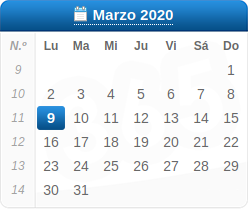
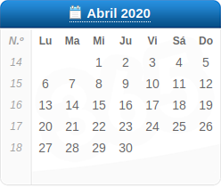
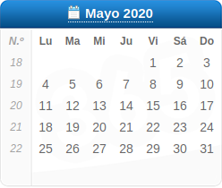
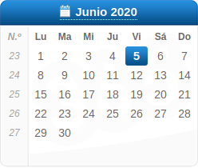

# **Memoria Final** 

## _Índice_
 
1. [**Referencias**](#id1)
    - Información personal.
    - Calendario y horario de las prácticas.
2. [**Centro De Prácticas**](#id2)
    - Razón social.
    - Actividad principal de la empresa o institución.
3. [**Memoria y descripción detallada de las tareas desarrolladas**](#id3)
    - Objetivos.
    - Descripción de las tareas desarrolladas.
4. [**Problemas planteados y procedimiento para su resolución**](#id4)
    - Exposición de las dificultades que han surgido durante el periodo.
5. [**Valoración de las tareas desarrolladas en relación con los estudios cursados**](#id5)
    - Explicación de los conocimientos adquiridos en el grado aplicados en la práctica.
6. [**Valoración de las tareas desarrolladas en relación con los estudios cursados**](#id6)
    - ¿Qué he aprendido? 
7. [**Valoración de las prácticas y sugerencias de mejora**](#id7)
    - Disertar el resultado de las prácticas, así como su utilidad.
    - ¿Se han llevado a cabo mis expectativas?

- - -
   

# Referencias

### Información personal

| NIA           | Nombre        | Apellidos     | Correo Electrónico       |
| ------------- | ------------- | ------------- | -------------------------|
| 10335837      | Mario         | Silla Olmos   | silolm.mail@gmail.com    |

  

### Calendario y horario de las prácticas

 

|               | Lunes         | Martes        | Miércoles       | Jueves        | Viernes       |
| ------------- | ------------- | ------------- | --------------- | ------------- | ------------- |
| 08:00 - 14:00 |               |               |                 |               |               |
|               |               |               |                 |               |               |
| 14:00 - 15:00 | Comida        | Comida        | Comida          | Comida        | Comida        |
|               |               |               |                 |               |               |
| 15:00 - 17:00 |               |               |                 |               |               |

   

# Centro De Práctica

### Razón social

| Detalles Empresa | Nombre         | Instructor                 | Alumno             | Horas realizadas   |
| ---------------- | -------------- | -------------------------- | ------------------ | ------------------ |
|                  | Vozfusion S.L. | Jesús Miguel Esteve Picazo | Mario Silla Olmos  | 400                |

  

### Actividad principal de la empresa o institución

- Conectividad VoIP
  
- Aprovisionamiento
  
- Desarrollo web
  
- Facturación
  
- Operadora